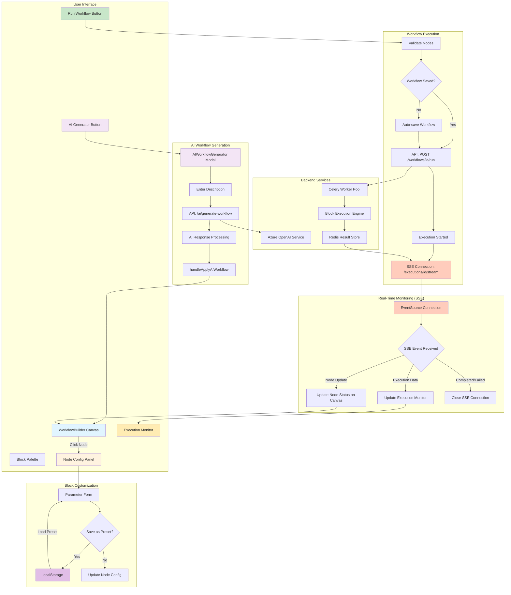
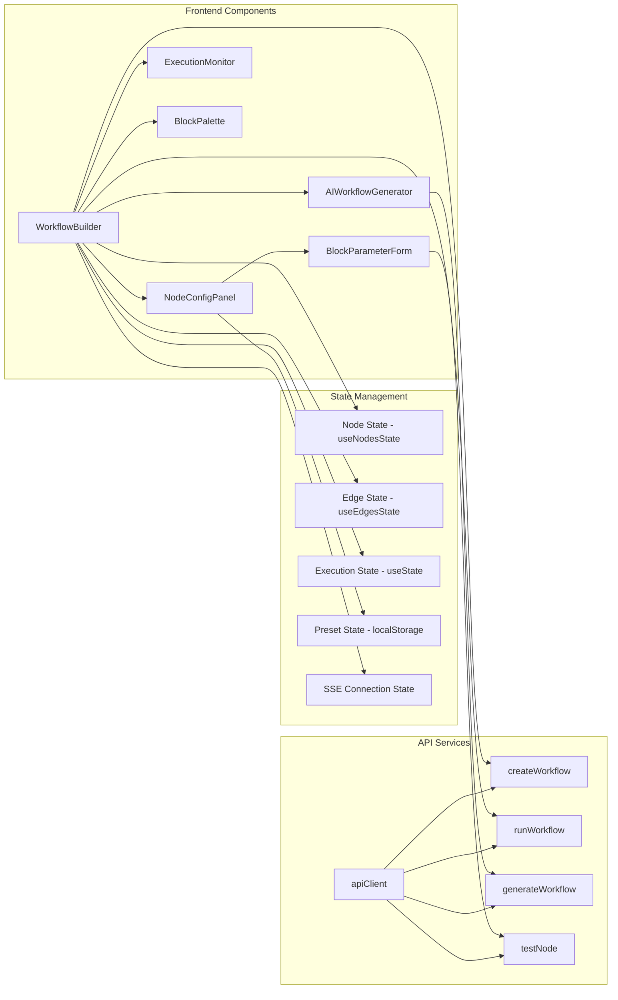
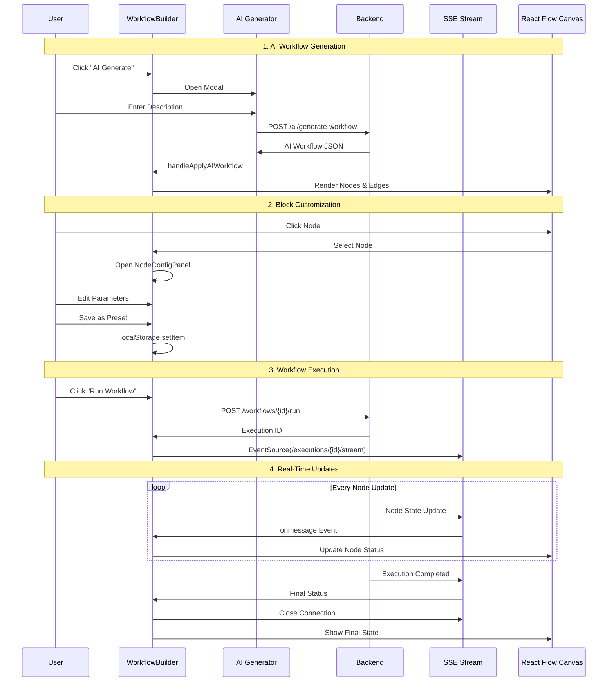
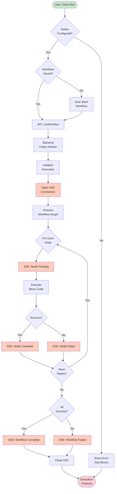
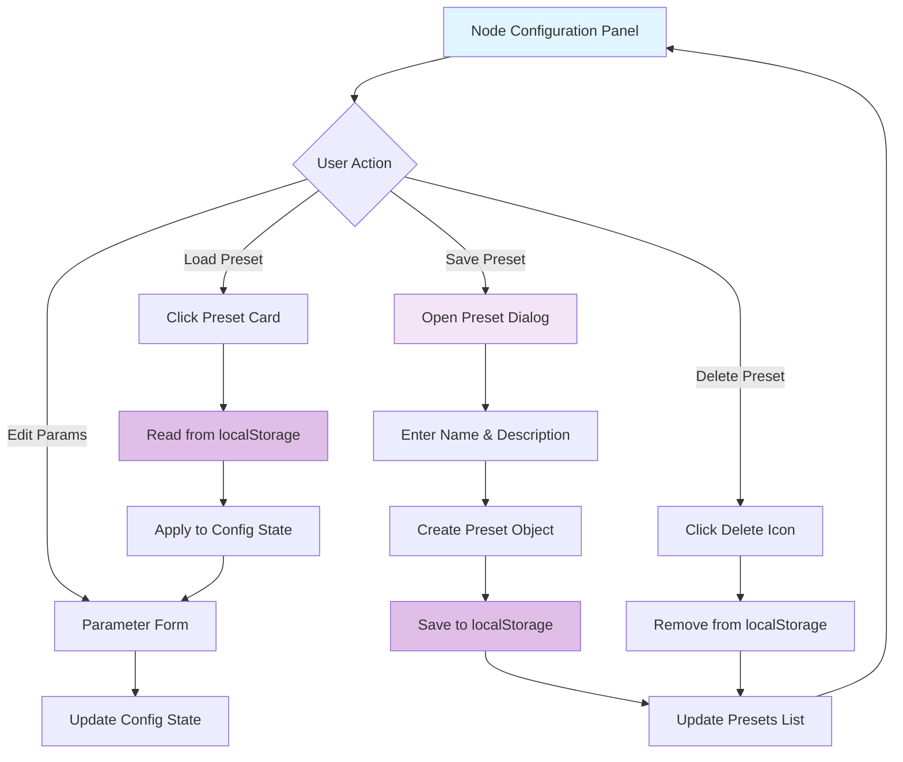
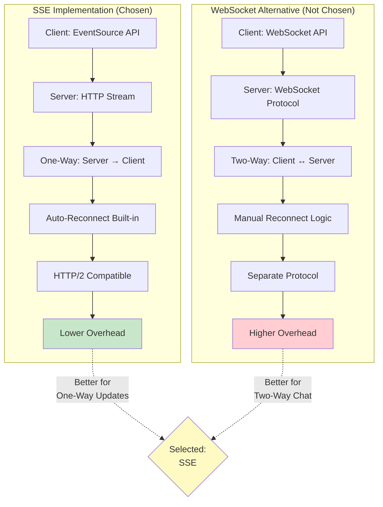
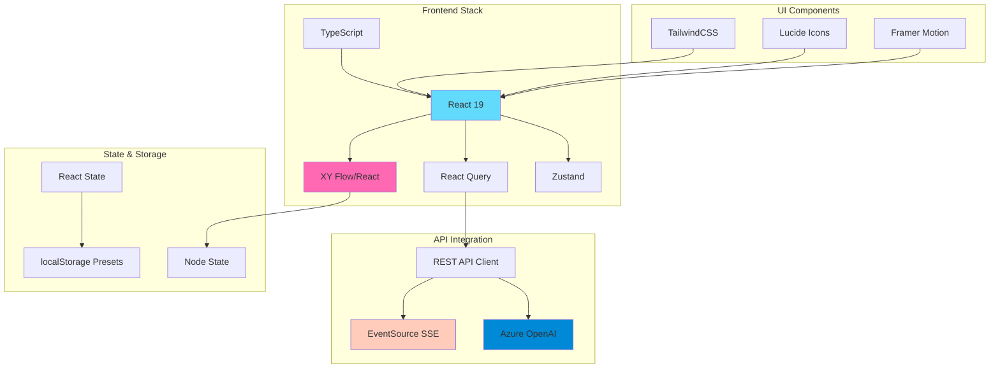
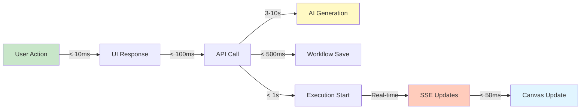

# Pankh AI Workflow System - Architecture Diagram

## Complete End-to-End Flow



## Component Architecture



## Data Flow Sequence



## Block Execution Flow



## Preset Management System



## SSE vs WebSocket Comparison



## Technology Stack & Integration



## Design Patterns Used

### 1. Observer Pattern (SSE)
```
EventSource (Observer) → Backend (Subject) → Node Updates
```

### 2. Facade Pattern (API Client)
```
Components → apiClient → Backend APIs
```

### 3. Strategy Pattern (Block Execution)
```
Block Type → Execution Strategy → Result
```

### 4. Factory Pattern (Node Creation)
```
Block Definition → Node Factory → React Flow Node
```

### 5. Repository Pattern (Preset Storage)
```
Preset Operations → localStorage Repository → Data Persistence
```

## Key Features Summary

| Feature | Technology | Status |
|---------|-----------|--------|
| Visual Workflow Builder | React Flow | ✅ Complete |
| AI Workflow Generation | Azure OpenAI API | ✅ Complete |
| Block Customization | React State + localStorage | ✅ Complete |
| Parameter Presets | localStorage | ✅ Complete |
| Real-Time Execution | SSE (EventSource) | ✅ Complete |
| Workflow Execution | Backend API + Celery | ✅ Complete |
| Live Node Status | SSE Updates | ✅ Complete |
| Execution Monitoring | React Components | ✅ Complete |

## Performance Characteristics


